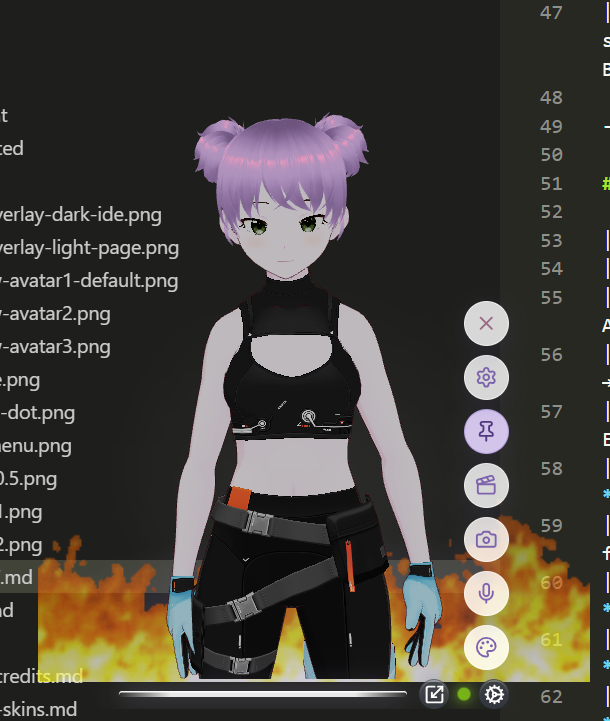
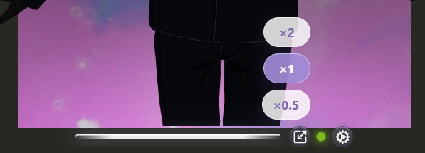

<div align="center">
  
</div>

<p align="center">
  <b>Give a face to your AI — and anything else you listen to.</b>
</p>

<p align="center">&nbsp;</p>

<div align="center">
  <a href="https://github.com/ARPAHLS/avatar/releases/download/v0.8.0/AVATAR-Setup-0.8.0.exe"></a>
  <a href="LICENSE"></a>
  <a href="https://vrm.dev/en/"></a>
  <a href="https://hub.vroid.com/en/"></a>
</div>

<p align="center">
  <a href="https://doi.org/10.5281/zenodo.21791157"></a>
</p>

<p align="center">&nbsp;</p>

<p align="center">
  Animate cloud APIs, web apps, or local LLMs with a VRM character that lipsyncs and moves while you work.<br />
  Or keep a companion on screen while you study, watch a video, hear a podcast, speech, or audiobook — a character that follows the audio instead of a blank background.
</p>

<p align="center">
  
</p>

<p align="center">
  <a href="#quick-start">Quick Start</a> ·
  <a href="https://github.com/ARPAHLS/avatar/releases/download/v0.8.0/AVATAR-Setup-0.8.0.exe">Download .exe</a> ·
  <a href="docs/using-the-app.md">User guide</a> ·
  <a href="docs/README.md">Documentation</a> ·
  <a href="docs/getting-started/installation.md">Install</a> ·
  <a href="docs/avatars.md">Avatars</a> ·
  <a href="docs/environments.md">Environments</a> ·
  <a href="docs/voice/audio-sources.md">Voice</a> ·
  <a href="docs/vroid-hub.md">VRoid Hub</a> ·
  <a href="docs/animations/vrma.md">Animations</a> ·
  <a href="docs/user-settings.md">Settings</a> ·
  <a href="docs/assets-and-credits.md">Assets & Credits</a> ·
  <a href="CHANGELOG.md">Changelog</a>
</p>

---

**AVATAR** is an open-source **desktop companion** from ARPA. The primary experience is the **Electron** transparent always-on-top overlay. A Windows **[`.exe` installer](https://github.com/ARPAHLS/avatar/releases/download/v0.8.0/AVATAR-Setup-0.8.0.exe)** is available for end users. The browser / localhost Vite app is for **development and contributors**.

It renders `.vrm` models, plays `.vrma` motion, and drives mouth shapes from live audio — including system / device output on desktop.

## What this is

- **Electron desktop overlay** — pin, snap, window scale, device loopback ([user guide](docs/using-the-app.md) · [settings](docs/user-settings.md))
- **VRM avatars** — bundled samples, your own `.vrm` folder from Settings → Directories, static Appearance thumbnails ([avatars](docs/avatars.md))
- **VRoid Hub** — bring-your-own OAuth app; connect in Settings, pick characters in Appearance ([VRoid Hub](docs/vroid-hub.md))
- **Environments** — built-ins, Custom folder from Settings → Directories, color fade, or none ([environments](docs/environments.md))
- **Persistent settings** — `config.yaml` across launches ([user settings](docs/user-settings.md))
- **VRMA animations** — Default greeting + loop, bundled clips, or your own `.vrma` folder from Settings → Directories; **Motion Deck** one-shot hotkeys ([VRMA](docs/animations/vrma.md) · [user settings](docs/user-settings.md#motion-deck-motiondeck))
- **Local agent bus & MCP** — opt-in loopback server on `127.0.0.1` so scripts and editor agents can play animations, swap avatars and set the environment; the same endpoint is a Streamable HTTP MCP server ([local agent bus](docs/agents/local-bus.md))
- **Browser / localhost** — for contributors ([install](docs/getting-started/installation.md))

<p align="center">
  
</p>

## Quick start

### 1. Windows installer (easiest)

Download **[AVATAR-Setup-0.8.0.exe](https://github.com/ARPAHLS/avatar/releases/download/v0.8.0/AVATAR-Setup-0.8.0.exe)** — no Node.js. Run the installer, accept the EULA, launch **AVATAR**.

([All releases](https://github.com/ARPAHLS/avatar/releases) · [install notes](docs/getting-started/installation.md))

### 2. Desktop from source (Electron)

Requires **Node.js 20+** and **npm**:

```bash
cd avatar
npm install
npm run desktop
```

### 3. Web app (browser)

```bash
cd avatar
npm install
npm run dev
```

Open [http://localhost:5173](http://localhost:5173). Prefer Electron when testing lip sync against system audio.

---

Gear menu: Appearance (Avatars · Environments) · Voice · Camera · Animations · Settings. Scale control sits next to the gear.

**First launch behavior:** Greeting once, then a looping motion set; desktop audio defaults to device output; preferences restore from `config.yaml` on later launches. Full walkthrough: [Using the app](docs/using-the-app.md) · [First session](docs/getting-started/first-session.md).

<p align="center">
  
  
</p>

### Try lip sync

1. Gear → **Voice** → Device output (desktop) or Microphone / Tab (browser)
2. Green pulsating dot next to the gear = active

More: [Audio sources](docs/voice/audio-sources.md) · [Lip sync](docs/voice/lip-sync.md) · [Using the app → Voice](docs/using-the-app.md#4-voice--lip-sync)

<p align="center">
  
  
</p>

### Try animations

Gear → **Animations** → **Default** (greeting, then motion loop). Catalog: [VRMA animations](docs/animations/vrma.md).

<p align="center">
  
  
</p>

### Swap avatars

**Desktop / installer:** Gear → **Settings** → **Directories** → **Avatars** → **Custom**, pick a folder of `.vrm` files. Appearance then shows that list. You can also use **VRoid Hub** under Appearance. Guide: [Avatars](docs/avatars.md) · [VRoid Hub](docs/vroid-hub.md).

**From source (contributors):** drop `avatar4.vrm` into `avatar/src/assets/avatars/` and restart — naming is covered in the avatars guide.

### Custom environments

**Desktop / installer:** Gear → **Settings** → **Directories** → **Environments** → **Custom**, pick a folder of `.gif` / `.png` / `.jpg` / `.jpeg`. Built-ins stay; Appearance → Environments gains a **Custom** expander. Guide: [Environments](docs/environments.md).

<p align="center">
  
</p>

**From source (contributors):** trial files can also go in `avatar/src/assets/environments/custom/` while Directories is Default — picked up by the dev server only, and left out of every production build.

## Documentation

| Topic | Links |
| :--- | :--- |
| **User guide** | [Using the app](docs/using-the-app.md) |
| **Getting started** | [Install](docs/getting-started/installation.md) · [First session](docs/getting-started/first-session.md) |
| **Download** | [AVATAR-Setup-0.8.0.exe](https://github.com/ARPAHLS/avatar/releases/download/v0.8.0/AVATAR-Setup-0.8.0.exe) · [v0.8.0 release](https://github.com/ARPAHLS/avatar/releases/tag/v0.8.0) |
| **Characters & stage** | [Avatars](docs/avatars.md) · [Environments](docs/environments.md) · [Camera & lighting](docs/camera-and-lighting.md) |
| **Motion & voice** | [VRMA](docs/animations/vrma.md) · [Audio sources](docs/voice/audio-sources.md) · [Lip sync](docs/voice/lip-sync.md) |
| **VRoid Hub** | [VRoid Hub connection](docs/vroid-hub.md) |
| **Settings** | [config.yaml & resets](docs/user-settings.md) |
| **Architecture** | [Overview](docs/architecture/overview.md) · [Layout](docs/development/project-layout.md) |
| **Assets** | [Assets & credits](docs/assets-and-credits.md) · [Manifest](docs/assets-manifest.yml) |

## Repository layout

```text
avatar/
├── docs/
│   ├── using-the-app.md
│   ├── screenshots/
│   └── …
├── avatar/
│   ├── electron/
│   ├── public/
│   └── src/
│       ├── assets/avatars/
│       └── assets/environments/
│           ├── stars.gif / code.gif / bloom.gif
│           └── custom/
├── CHANGELOG.md
├── CITATION.cff
└── README.md
```

## Assets & licensing (summary)

Sample characters are made in **VRoid Studio** / **VRoid Hub** with free setups — **no paid models or wearables** are used in this repo.

Bundled motions are the **7 free VRMA files** from the **VRoid Project** on [BOOTH](https://booth.pm/) (2024). Copyright remains with **pixiv Inc.** Commercial use requires:

> Animation credits to pixiv Inc.'s VRoid Project  
> （キャラクターアニメーション: ピクシブ株式会社 VRoidプロジェクト）

Built-in environment GIFs (Stars / Code / Bloom) are from [GIPHY](https://giphy.com/) — credits in [Assets & credits](docs/assets-and-credits.md#built-in-environment-gifs).

Full terms: **[docs/assets-and-credits.md](docs/assets-and-credits.md)** · Machine-readable inventory: **[docs/assets-manifest.yml](docs/assets-manifest.yml)** · Rights holders: **input@arpacorp.net**

Beyond the bundled samples, you can bring your own characters and backdrops: **Settings → Directories** (local `.vrm` / image folders) and **VRoid Hub** (linked characters, session-only). See [Avatars](docs/avatars.md) · [Environments](docs/environments.md) · [VRoid Hub](docs/vroid-hub.md) · [Using the app](docs/using-the-app.md).

## Privacy

Runs locally. Audio uses Web APIs / Electron loopback so the mouth can follow what you hear; **AVATAR only measures levels on this device for lip sync — nothing is uploaded.** Capture may ask for microphone or screen/audio permission; that stays in the local process. Details: [audio sources — privacy](docs/voice/audio-sources.md#privacy-what-stays-local).

To report a security vulnerability, see **[SECURITY.md](SECURITY.md)** (private report — do not file exploit details in public issues).

---

<div align="center">
  
  <br />
  <sub>Built & Maintained by <strong>ARPA Hellenic Logical Systems</strong></sub>
</div>
