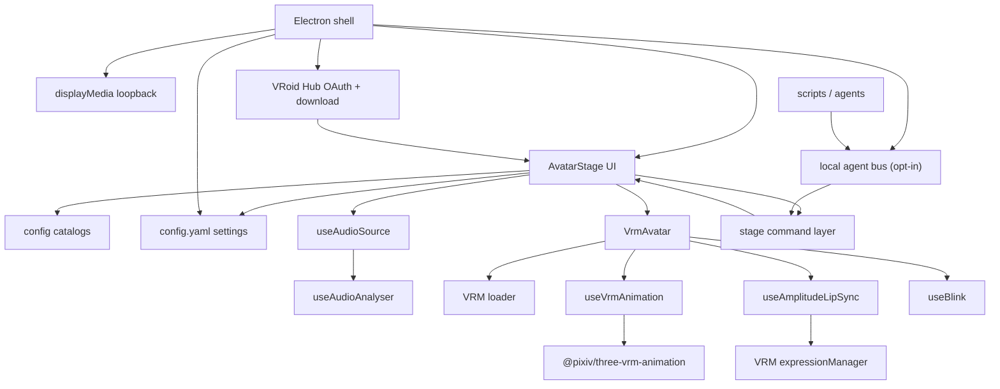

# Architecture overview

## Layers

### Presentation (`components/`)

`AvatarStage` owns the stage, gear menus, glass drawers, window scale, and settings hydration. Panels:

| Panel | Contents |
| :--- | :--- |
| `PalettePanel` | Avatar picker (built-ins + optional VRoid Hub grid), Environments |
| `VoicePanel` | Audio source / lip sync controls |
| `CameraPanel` | Camera, light, avatar transform |
| `DesktopPanel` | Overlay toggle + 3×3 snap pad |
| `DirectoriesPanel` | Custom avatar / animation / environment folders (desktop) |
| `VroidHubPanel` | OAuth credentials / connect (Settings) and Hub character pick (Appearance) |
| `AgentBusPanel` | Local agent bus opt-in, port, token (Settings, desktop) |
| Settings drawer | Overlay, Snap, Directories, Animation hotkeys, Agents, VRoid Hub, System (**Reset all settings**) |

### Configuration (`config/`)

Catalogs for avatars, animations (including the Default sequence), audio sources, environments, window scale, visual defaults, and the `userSettings` schema.

The animation catalog is split so its lookups stay unit-testable: `vrmaAssets.js` holds the Vite-resolved `.vrma` imports, `animationLookup.js` the pure catalog lookups (no asset imports, so plain `node --test` can load it), and `animations.js` composes both and re-exports them as the single entry point. Every lookup takes the catalog it should read, because a custom animations folder replaces the bundled list at runtime.

### Runtime hooks (`hooks/`)

| Hook | Role |
| :--- | :--- |
| `useVrmAnimation` | Loads `.vrma`, sequences, cross-fades |
| `useAmplitudeLipSync` | Maps audio level → cycling visemes |
| `useAudioSource` | Capture lifecycle (browser + Electron) |
| `useBlink` | Idle blink on expression manager |
| `useStageCommands` | Resolves a command and applies the resulting action — the only place one is applied |
| `useAgentBus` | Reports the stage to the main process and applies what the bus accepted (desktop) |

### Stage commands (`lib/stageCommands.js`)

Every state change a trigger can ask for goes through one validated entry point:
`resolveStageCommand` turns a request into an action or an error code, and `useStageCommands` is
the only thing that applies one. Menus, animation hotkeys and the local agent bus therefore share
one set of command names and one set of errors, instead of each reimplementing the sequences that
are easy to get wrong.

The module is free of React and asset imports, so plain `node --test` can load it — and so can the
Electron main process, which is how the agent bus validates a request without a second copy of the
rules.

### Desktop (`electron/`)

Frameless transparent window, always-on-top overlay, snap, scale presets, system audio loopback via `setDisplayMediaRequestHandler`, **`config.yaml`** persistence in Electron `userData` (`settingsStore.cjs`), and optional **VRoid Hub** OAuth (loopback callback server + encrypted credentials / tokens + licensed model download), and the opt-in **[local agent bus](../agents/local-bus.md)** (`agent-bus.cjs`, off by default).

The bus is three one-way hops rather than a request/response channel: the window reports its
catalog and current selection, `agent-bus.cjs` validates an incoming HTTP or WebSocket request
against that report and answers the caller itself, and the accepted action is sent back to the
window to apply. Acceptance is decided in main, application happens in the renderer — which is why
a `200` means accepted, not that the model has finished loading. The token lives encrypted beside
the VRoid Hub credentials (`agent-bus-token.cjs`), not in `config.yaml`, which the renderer
rewrites on every change.

## Design notes

- **Electron first** — desktop overlay, scale, and device loopback are the primary product path; browser is for development.
- **VRMA first** — skeletal clips (and sequences) drive the body while active.
- **Drop-in avatars** — `avatarN.vrm` naming auto-registers models.
- **VRoid Hub optional** — bring-your-own OAuth app; Hub VRMs are session-only in memory (not in `config.yaml`).
- **Persistent prefs** — avatar, camera, lighting, environment, animation, audio source, overlay, scale, and directories survive restarts; reset from Settings.
- **Chrome contrast** — whitish bar/buttons on dark backdrops; silver only when the region behind the bar is clearly light.
- **Future triggers** — keyword/event mapping will reuse the same animation catalog.
