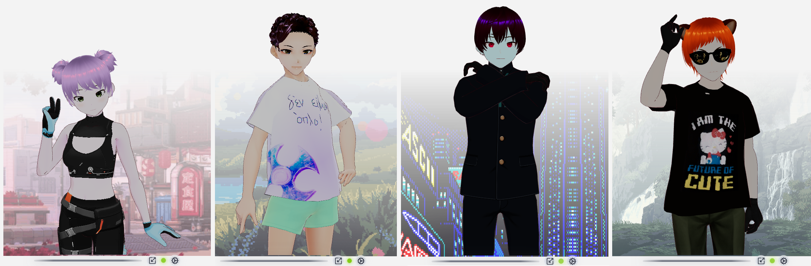
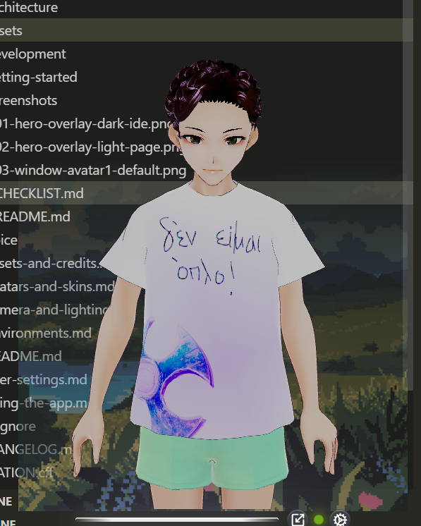
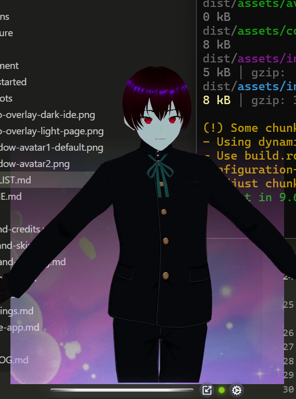
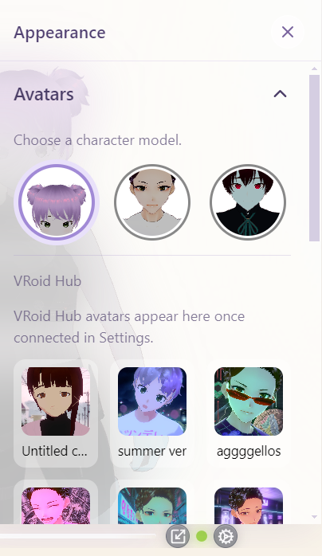
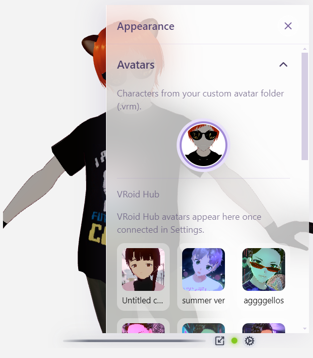
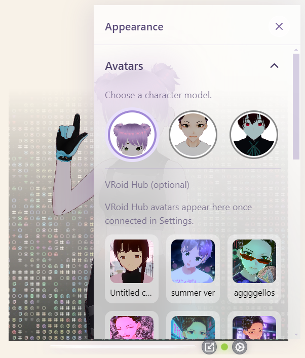
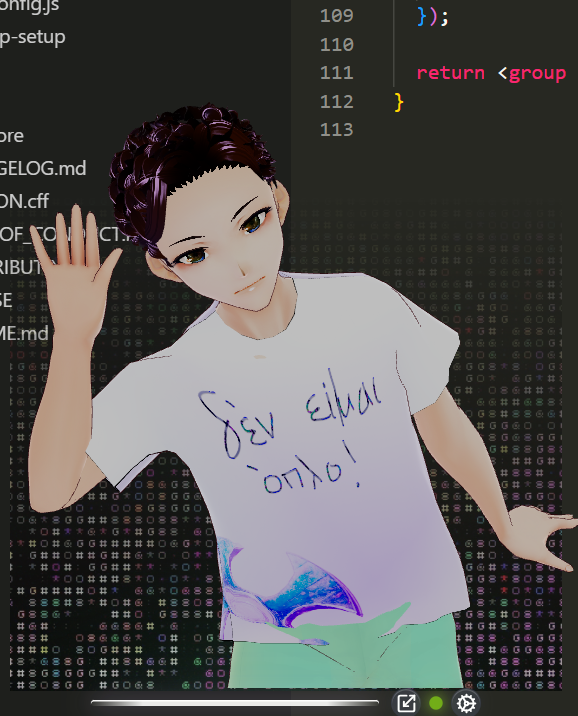

# Avatars

## Bundled characters

| UI label | File |
| :--- | :--- |
| Avatar 1 | `avatar1.vrm` |
| Avatar 2 | `avatar2.vrm` |
| Avatar 3 | `avatar3.vrm` |

Path: `avatar/src/assets/avatars/`.

Gear → **Appearance** → **Avatars**. Selection persists as `avatarId` in [config.yaml](user-settings.md).

Picker cards use **static thumbnails** (not live 3D previews), so Appearance opens quickly. Bundled portraits live under `src/assets/avatars/thumbs/` (regenerate with `npm run thumbs` when a bundled `.vrm` or the catalog changes — see [Contributing](../CONTRIBUTING.md#bundled-picker-thumbnails)). Custom-folder portraits are rendered once and cached under Electron `userData/thumbnails/` (keyed by path, mtime, and size).

  

  
  
  

  

---

## Custom avatar folder (desktop)

Gear → **Settings** → **Directories** → **Avatars** → **Custom**, pick a folder of `.vrm` files.

- Appearance → Avatars shows **those files instead of** bundled Avatar 1/2/3.
- Optional **VRoid Hub** block still appears under the strip.
- Reset the directory (or Reset all settings) to restore bundled avatars.

  

---

## Drop-in naming (bundled / contributor)

| Pattern | Meaning |
| :--- | :--- |
| `avatarN.vrm` | New character **Avatar N** (N = 1, 2, 3, …) |

Vite’s glob picks them up after restart. No manual registry edit for basic drop-ins. Letter-suffixed files like `avatar1B.vrm` are ignored.

---

## VRoid Hub characters (optional)

On the **desktop** app you can connect your own VRoid Hub OAuth app and load
characters you own (or hearted models available to other users) without
dropping a `.vrm` into `src/assets/avatars/`.

| Where | What |
| :--- | :--- |
| Gear → **Settings** | Register / paste OAuth credentials, Connect / Disconnect |
| Gear → **Appearance** → **Avatars** | Built-ins **plus** Hub portraits once connected |

Hub characters are **session-only** (held in memory, not saved to
`config.yaml` or disk). Full walkthrough: [VRoid Hub connection](vroid-hub.md).

  

  

---

## Framing

All avatars share the same default camera (`X = -0.01`, `Y = 0.59`, …). If a new model sits high/low, use **Camera & Lighting** or that model’s own VRM ground offset. See [Camera & lighting](camera-and-lighting.md).

---

## Credits & licenses

Third-party VRM / texture licenses: [Assets & credits](assets-and-credits.md). Contact `input@arpacorp.net` for contribution questions.

Linked Hub models keep their authors’ VRoid Hub conditions of use — review
them in-app before using a hearted character.
