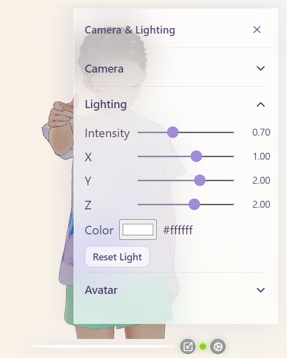

# Camera & lighting

Gear → **Camera & Lighting**.

All values autosave to `config.yaml` (or browser local storage). See [User settings](user-settings.md).

  

  
  

---

## Camera

Controls the Three.js perspective camera that frames the VRM.

| Slider | Default | Range | Role |
| :--- | :--- | :--- | :--- |
| **X** | `-0.01` | −2 … 2 | Shift left / right |
| **Y** | `0.59` | 0.5 … 2.5 | Raise / lower view (keeps heads in frame at default) |
| **Z** | `1.69` | 0.5 … 3 | Move camera closer / farther |
| **Look Y** | `0.5` | 0.5 … 2.5 | Height of the look-at point |
| **FOV** | `26.8` | 10 … 60 | Field of view (higher = wider / smaller subject) |

### Reset

- **Reset Camera** — restores every camera field to the defaults above.
- **Double-click** a slider — resets only that field.

---

## Lighting

| Control | Default | Notes |
| :--- | :--- | :--- |
| **Intensity** | `0.7` | Ambient + directional share this intensity in the stage |
| **X / Y / Z** | `1 / 2 / 2` | Directional light position |
| **Color** | `#ffffff` | Directional light color (picker + hex) |

### Reset

- **Reset Light** — full lighting defaults.
- Double-click intensity or axis sliders for single-control reset.

---

## Avatar transform

Offsets the loaded VRM in the scene (not the camera).

| Slider | Default |
| :--- | :--- |
| **X** | `0` |
| **Y** | `-1.03` |
| **Z** | `-1.48` |

Facing defaults to a π Y rotation (toward the camera). **Reset Avatar** restores position and that facing. There is no rotation slider in the UI yet.

  
  
  

---

## Tips

- Prefer nudging **Camera Y/Z** before large avatar Y moves — camera framing is what most users mean by “zoom.”
- After experiments, **Reset Camera** + **Reset Light** + **Reset Avatar**, or **Settings → Reset all settings**, returns to the factory look.
- Defaults are shared by all avatars so Avatar 2 / 3 stay framed without per-model cameras (for now).
