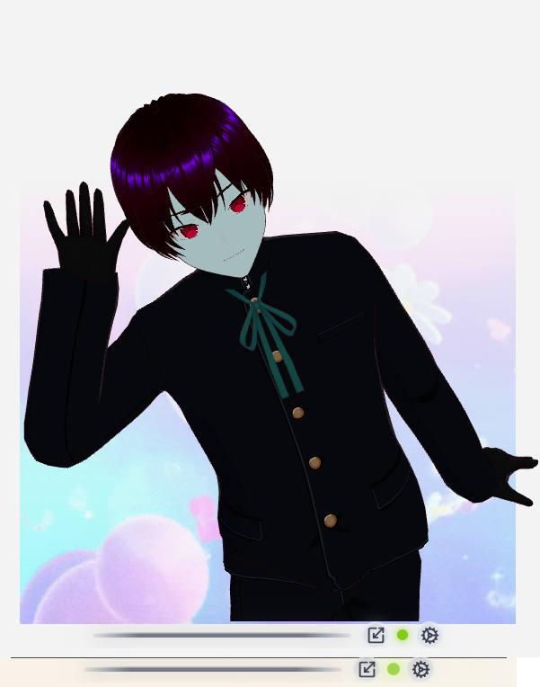
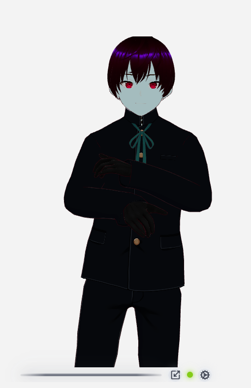
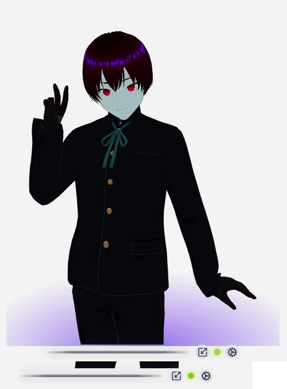
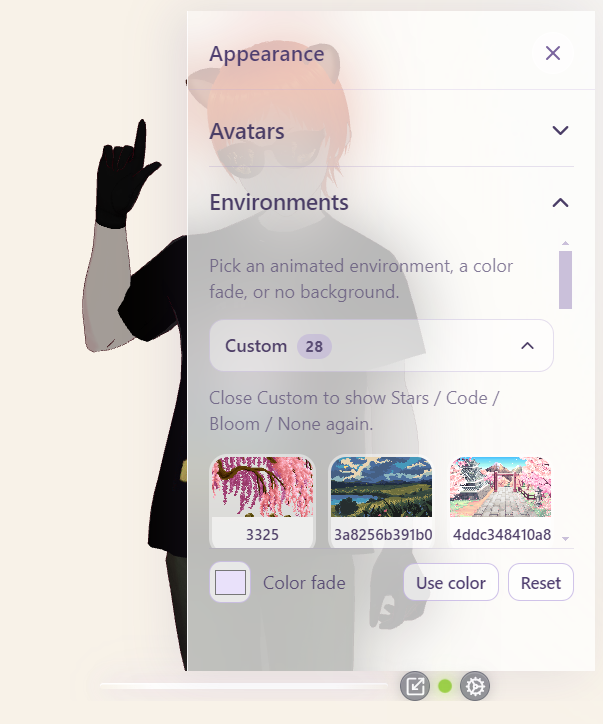
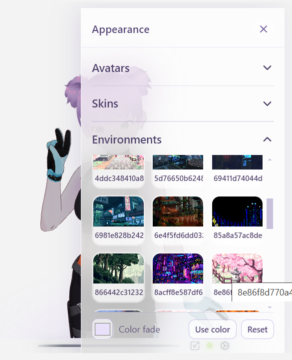
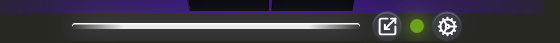
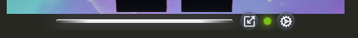

# Environments

Backgrounds live under `avatar/src/assets/environments/`.

Open Gear → **Appearance** → **Environments**.

  
  

---

## Built-in

| Id | Label | File | Look |
| :--- | :--- | :--- | :--- |
| `stars` | Stars | `stars.gif` | Dark starfield |
| `code` | Code | `code.gif` | Code rain |
| `bloom` | Bloom | `bloom.gif` | Bright pastel bloom |
| — | None | — | No GIF / glow — desktop shows through in overlay |
| — | Color fade | — | Soft radial glow from a hex color |

Credits for the three GIFs (GIPHY): see [Assets & credits](assets-and-credits.md#built-in-environment-gifs).

The picker shows a **still poster** for each of these (committed under `src/assets/environments/thumbs/`), not the GIF — only the environment you actually select animates, and only on the stage. Regenerate the posters with `npm run thumbs` if you change a bundled GIF or the catalog; see [Contributing](../CONTRIBUTING.md#bundled-picker-thumbnails).

  
  
  
  

  

### Color fade

1. Pick a color.  
2. Click **Use color**.  
3. **Reset** restores lavender `#e9e1fa`.

The Color fade row stays pinned under the environment list (**Use color** + **Reset** on one line).

---

## Custom environments

### Desktop — Settings → Directories

1. Gear → **Settings** → **Directories** → **Environments** → **Custom**.
2. Pick a folder of `.gif`, `.png`, `.jpg`, or `.jpeg` files.
3. Appearance → Environments keeps **Stars / Code / Bloom / None**, and shows a **Custom** expander when the folder has files.

Built-ins are **never** replaced by a custom env directory (unlike avatars).

Tiles in the Custom grid are **posters**, generated once per file and cached under Electron `userData/thumbnails/` (keyed by path, mtime, and size — the same cache avatar portraits use). A tile pulses while its poster is being made, and an animated file only ever animates on the stage. Nothing in the folder is read into memory until you select it, so folder size costs you disk, not RAM.

Because the file is read at selection time, a large image takes a moment to appear. The stage keeps showing the current background until the new one is ready, then changes over in one step — so a slow read looks like a delay, never a blank stage.

  

  

### Contributor — Vite `custom/` folder (dev)

The `custom/` folder is for **local trial media** when Directories is still Default. Files inside it are **not** committed to git (the empty folder is kept via `.gitkeep`).

**Production builds** (`npm run build`, `npm run desktop`, `npm run dist:win`) do not pack local Custom media — only the dev server reads this folder. Prefer Settings → Directories for installer users.

1. Drop media into `avatar/src/assets/environments/custom/` (`.gif`, `.png`, `.jpg`, `.jpeg`).  
2. Restart Vite (`npm run dev` / `npm run dev:desktop`) so Vite’s glob picks them up.  
3. Gear → Appearance → Environments → open **Custom**.

To check trial media against a production bundle, opt in explicitly — `npx cross-env AVATAR_INCLUDE_CUSTOM=1 npm run build` (works in PowerShell, `cmd` and bash).

While Custom is open, built-in thumbs (Stars / Code / Bloom / None) hide so the library has room; close Custom to show them again. Scroll the Custom grid; Color fade stays visible underneath.

  

Labels come from the filename. Keep trials here; when you want a permanent built-in, copy a keeper next to `stars.gif` / `code.gif` / `bloom.gif` and register it in `src/config/environments.js`.

---

## Contrast (bar & buttons)

The glass bar sits over the **desktop** (overlay) or the window chrome (windowed). Colors adapt:

| Backdrop | Bar | Buttons |
| :--- | :--- | :--- |
| Dark | Whitish | Darker grey glass + white icons |
| Light | Grey | Lighter grey glass + dark icons |

  
  
  

- **Overlay:** samples desktop luminance near the window when the window **settles** after a move/snap (and on focus) — not on a continuous timer. Chrome colors still crossfade smoothly.  
- **Browser / windowed:** uses the environment (e.g. Bloom → light chrome; Stars/Code/None → dark).

Custom images are sampled on their lower strip when environment-based tone is used.

---

## Asset location

Do **not** put environment GIFs only in `public/` — the app imports from `src/assets/environments/` so Vite can bundle them.

Built-ins (`stars.gif`, `code.gif`, `bloom.gif`) ship with the repo and the installer. **`custom/` media stays on your machine** (dev only; not in the packaged app).

See also: [Using the app](using-the-app.md).
