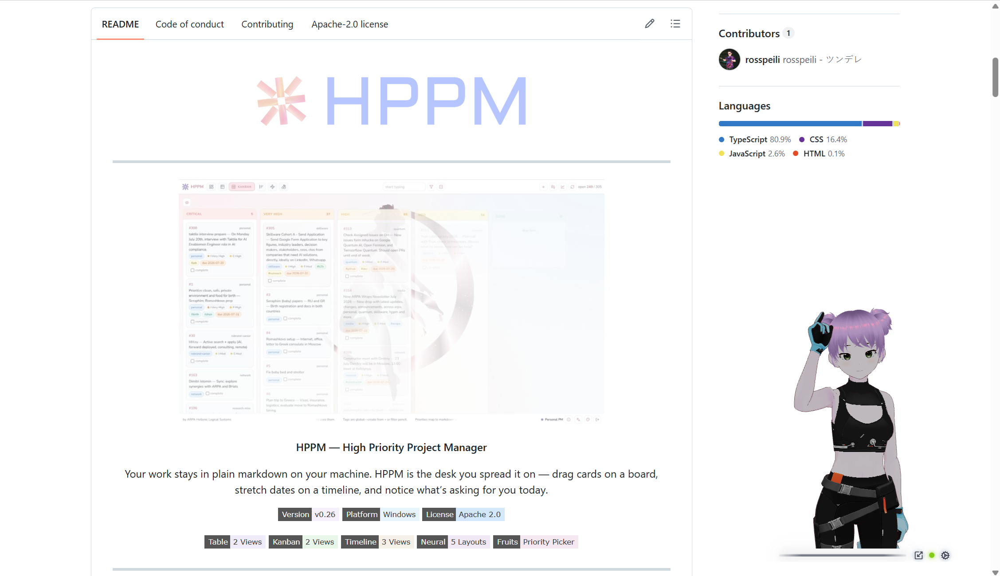

# First session

New to AVATAR? Prefer the [Windows installer](https://github.com/ARPAHLS/avatar/releases/download/v0.8.0/AVATAR-Setup-0.8.0.exe) when you can. Otherwise see [Installation](installation.md).

For every control in depth: **[Using the app](../using-the-app.md)**.

## 1. Launch

- **Installer:** start **AVATAR** from the Start menu or desktop shortcut.  
- **From source:** `cd avatar` → `npm install` → `npm run desktop`

A transparent window should appear on top of your other apps.

  

## 2. Orient yourself

| Control | What it does |
| :--- | :--- |
| **Glass line** | Drag to move |
| **Scale** (icon) | ×0.5 / ×1 / ×2 |
| **Green dot** | Lip sync is live |
| **Gear** | All panels and menus |

On first launch you get **Avatar 1**, **Default** animation (Greeting, then a loop of poses), lavender **color fade**, and on desktop **Device output** audio.

  
  

## 3. Try the essentials (2 minutes)

1. Gear → **Appearance** → pick **Avatar 2** or **3**, then an environment (**Code**, **Stars**, **None**, …).  
2. Gear → **Voice** → leave **Device output (auto)** (or pick a window / mic). Play music or a video — watch the mouth and the live dot (mint when quiet, greener when loud).  
3. Gear → **Animations** → try **Peace Sign**, then back to **Default**.  
4. Gear → **Settings** → click a **3×3** cell to snap; drag the bar afterward and notice the pad deselects.  
5. Scale menu → try **×0.5** then back to **×1**.  
6. *(Optional, desktop)* Gear → **Settings** → **Directories** → point Avatars / Environments at your own folders (`.vrm` / images).  
7. *(Optional, desktop)* Gear → **Settings** → set up VRoid Hub (own OAuth app), **Connect**, then Appearance → Avatars → pick a Hub character. Guide: [VRoid Hub](../vroid-hub.md).

## 4. Save / reset

Changes autosave to **`config.yaml`**.  
Need a clean slate? **Settings → Reset all settings**.  
Only framing wrong? **Camera & Lighting → Reset Camera**.

## Next

- [Using the app](../using-the-app.md) — full walkthrough  
- [Avatars](../avatars.md) · [Environments](../environments.md) · [Camera & lighting](../camera-and-lighting.md)
- [Voice](../voice/audio-sources.md) · [Animations](../animations/vrma.md) · [User settings](../user-settings.md) · [VRoid Hub](../vroid-hub.md)
