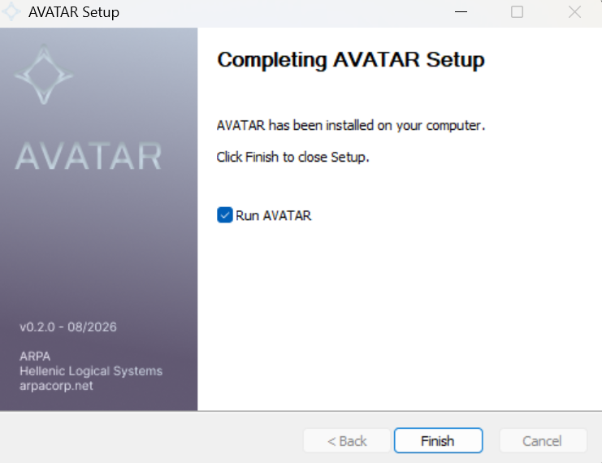

# AVATAR v0.4.0

**Released:** 2026-08-04  
**Tag:** [v0.4.0](https://github.com/ARPAHLS/avatar/releases/tag/v0.4.0)

Open-source **VRM desktop companion** — transparent always-on-top overlay with VRMA motion, real-time lip sync, **Settings → Directories** for your own avatar and environment folders, and optional **VRoid Hub** for link-only characters.

  

## Download

- **Windows (x64):** [AVATAR-Setup-0.4.0.exe](https://github.com/ARPAHLS/avatar/releases/download/v0.4.0/AVATAR-Setup-0.4.0.exe)

Drag the glass bar to move; use Gear for Appearance, Voice, Camera, Animations, and Settings.

## Install options

1. **Windows installer** (easiest) — no Node.js  
2. From source: `cd avatar && npm install && npm run desktop`  
3. Web / contributors: `npm run dev` → http://localhost:5173  

## Highlights

- **Settings → Directories:** Custom folders for avatars (`.vrm`, replaces built-ins) and environments (images, additive); choices persist in `config.yaml`
- Appearance → **Skins** removed — bring extra characters via Directories or VRoid Hub
- Zenodo concept DOI: [10.5281/zenodo.21791157](https://doi.org/10.5281/zenodo.21791157)
- VRoid Hub (optional), Electron overlay, device-output lip sync, and `config.yaml` prefs from 0.3.x

## Requirements

- Windows 10/11 x64
- No Node.js required for the installed app

## Docs

- [Using the app](../using-the-app.md)
- [Avatars](../avatars.md)
- [Environments](../environments.md)
- [User settings](../user-settings.md)
- [VRoid Hub](../vroid-hub.md)
- [Installation](../getting-started/installation.md)
- [Changelog](../../CHANGELOG.md)
- [Assets & credits](../assets-and-credits.md)
- [All releases](README.md)

## Notes

- The installer is currently **unsigned** (SmartScreen may warn — “More info” → Run anyway).
- Sample VRM/VRMA assets retain their upstream licenses (VRoid / pixiv). See [Assets & credits](../assets-and-credits.md).
- Hub characters stay in memory for the session only (not written to disk / `config.yaml`).

**ARPA Hellenic Logical Systems** · [arpacorp.net](https://arpacorp.net) · input@arpacorp.net
