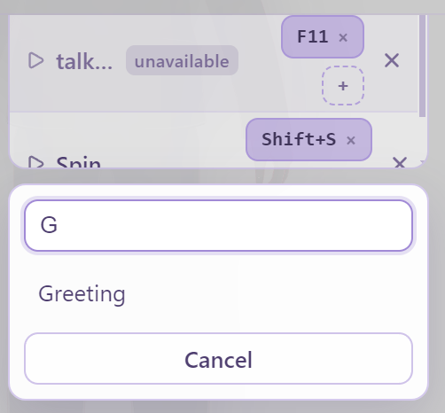

# User settings (`config.yaml`)

AVATAR remembers your preferences across launches.

## Where settings live

| Mode | Location |
| :--- | :--- |
| **Electron (desktop)** | `{userData}/config.yaml` — full path shown at the bottom of **Settings** (e.g. `C:\Users\…\AppData\Roaming\avatar\config.yaml` on Windows) |
| **Browser (dev)** | `localStorage` key `avatar.config.yaml` |

Electron `userData` is **app-owned** (not inside the git repo). Window **position/size bounds** also use a separate `window-state.json` beside it; scale and overlay are mirrored into `config.yaml` as well.

## What is saved

Autosave runs shortly after you change something (~400 ms debounce).

| Area | Fields |
| :--- | :--- |
| Character | `avatarId` (and reserved `skinId: default`) |
| Motion | `animationId`, `motionDeck` (see below) |
| Backdrop | `environment` (`env` + id, `color` + hex, or `none`) |
| Camera | `position`, `lookAt`, `fov` |
| Light | `intensity`, `color`, `position` |
| Avatar transform | `position`, `rotation` |
| Voice | `audioSourceId`, `lipSyncSensitivity`, `lipSyncMouthStrength`, `windowSourceId` (when picking a window) |
| Desktop | `overlayMode`, `windowScale` |
| Directories (desktop) | `directories.avatars` / `animations` / `environments` (`mode` + `path`) |
| Agents (desktop) | `agentBus.enabled` / `port` / `requireToken` (the token itself is stored encrypted, not here) |

### Motion Deck (`motionDeck`)

Settings → **Animation hotkeys**. Each row of the deck is a clip you can fire with a key or
by clicking its name; it plays **once** and then the Animations selection comes
back. Firing a card never changes `animationId`. Past five rows the deck gets a
filter box, which only narrows what is listed — it never touches the file.

<p align="center">
  
  
</p>

```yaml
motionDeck:
  - animationId: vrma-03
    label: Peace Sign
    keys:
      - F3
      - Ctrl+Shift+P
  - animationId: lib-anim-wave-4f2a9c1b7e03
    label: wave
    keys:
      - F4
```

| Field | |
| :--- | :--- |
| `animationId` | id from the animation catalog. A custom folder's ids are derived from the file path |
| `label` | remembered clip name. Shown when the id cannot be resolved, and used to re-point the card if you move or rename the animations folder |
| `keys` | chords, e.g. `F3`, `Ctrl+Shift+P`, `Alt+1`. Modifier names `Ctrl` / `Alt` / `Shift` / `Meta` (`Cmd`, `Win` and `Control` are read too). Bare `Escape`, `Tab`, `Enter` and `Space` are not accepted — the app's own UI needs them |

A chord belongs to one card: binding one that is already taken moves it, and a
hand-edited file that assigns the same chord twice gives it to the first card.
There is no limit on cards worth designing around — a deck is expected to be
short, but it also accumulates across animation folders, so it is not capped.

**Switching animation folders does not delete cards.** Cards whose clip is not
in the current folder are shown as *unavailable* and their keys do nothing, but
they stay in `config.yaml` and come back when the folder does. Settings →
Animation hotkeys → **Clear unavailable** is the only thing that removes them, apart from
**Reset all settings**.

Keys are only active while the AVATAR window has focus, and are ignored while
you are typing in a field.

### Not saved

- Uploaded **audio files** (re-pick after restart)
- Which snap-pad cell is highlighted
- Which drawer / accordion is open
- Transient UI (menus open/closed)
- **VRoid Hub characters** — session-only in memory; never written to `config.yaml` or as a local `.vrm` (see [VRoid Hub](vroid-hub.md))

### Related files in Electron `userData` (not `config.yaml`)

| File | Purpose |
| :--- | :--- |
| `vroid-hub-credentials.json` | Encrypted OAuth client ID / secret (`safeStorage`) |
| `vroid-hub-auth.json` | Encrypted access / refresh tokens |
| `window-state.json` | Window bounds (separate from YAML prefs) |

**Reset all settings** clears `config.yaml` preferences only. Use **Disconnect** / **Remove app credentials** in Settings for Hub session / OAuth app data.

## Factory defaults (after reset / first run)

| Setting | Default |
| :--- | :--- |
| Avatar | `avatar1` (**Avatar 1**) |
| Animation | `default` (Greeting once, then model pose → full body → peace → squat → shoot) |
| Environment | Color fade `#e9e1fa` |
| Camera | position `[-0.01, 0.59, 1.69]`, lookAt `[0, 0.5, 0]`, FOV `26.8` |
| Light | intensity `0.7`, color `#ffffff`, position `[1, 2, 2]` |
| Avatar transform | position `[0, -1.03, -1.48]` |
| Audio | Desktop: **Device output (auto)** (`system`); Browser: **Off** (`none`) |
| Overlay | On |
| Window scale | ×1 |
| Directories | Avatars / Animations / Environments → `default` (no custom paths) |
| Motion Deck | Empty |

## How to reset

### Everything

**Settings → Reset all settings** deletes the YAML file (or clears localStorage) and reapplies the factory defaults above.

<p align="center">
  
</p>

<p align="center">
  
</p>

### One area only

| Goal | Action |
| :--- | :--- |
| Camera only | Camera & Lighting → **Reset Camera** (or double-click one slider) |
| Lights only | **Reset Light** |
| Avatar pose offset only | **Reset Avatar** |
| Environment color only | Appearance → Environments → **Reset** |
| Directories (desktop) | Reset that row to **Default**, or Reset all |

## Example `config.yaml` shape

```yaml
version: 2
avatarId: avatar1
skinId: default
animationId: default
environment:
  type: env
  id: code
camera:
  position:
    - -0.01
    - 0.59
    - 1.69
  lookAt:
    - 0
    - 0.5
    - 0
  fov: 26.8
light:
  intensity: 0.7
  color: '#ffffff'
  position:
    - 1
    - 2
    - 2
avatarTransform:
  position:
    - 0
    - -1.03
    - -1.48
  rotation:
    - 0
    - 0
    - 0
audioSourceId: system
windowSourceId: null
overlayMode: true
windowScale: 1
directories:
  avatars:
    mode: default
    path: null
  animations:
    mode: default
    path: null
  environments:
    mode: default
    path: null
motionDeck: []
```

You normally never edit this by hand — use the UI. Hand-edits are fine if the app is closed; invalid values fall back to defaults on load.

With `directories.animations.mode: custom`, `animationId` holds a scanned id
(`lib-anim-<name>-<hash>`) instead of a bundled one. The hash comes from the
file's path, so the same clip stays selected across restarts and rescans; a
missing file falls back to the first clip in the folder, and switching the row
back to `default` returns to the bundled `default` sequence.

`skinId: default` is a reserved legacy field kept for config compatibility.
Newer installs should use `avatarId` (or `directories` custom avatar folders)
and leave `skinId` untouched.

`avatarTransform.rotation` is your own framing rotation only. Whether a model
needs turning to face the camera is decided per model from its VRM spec version
(VRM 0.0 faces away and is flipped automatically; VRM 1.0 already faces you), so
it is not — and must not be — part of this value. Version 1 configs did store
that flip here; they are converted automatically on first load under version 2.
