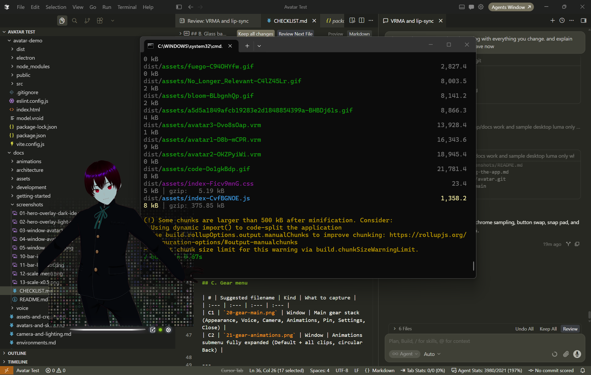
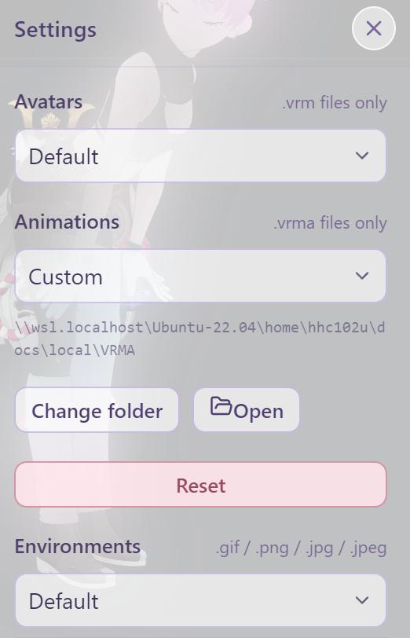
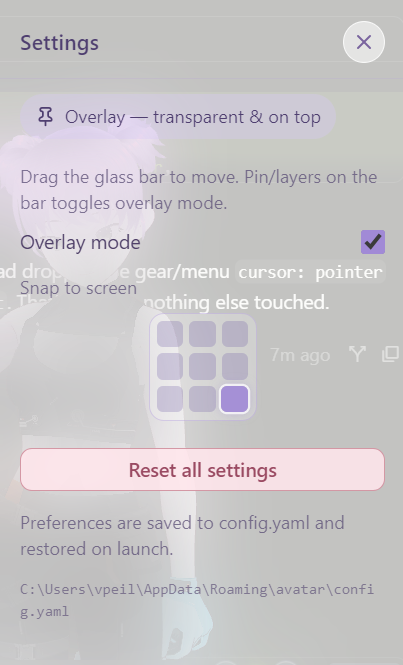
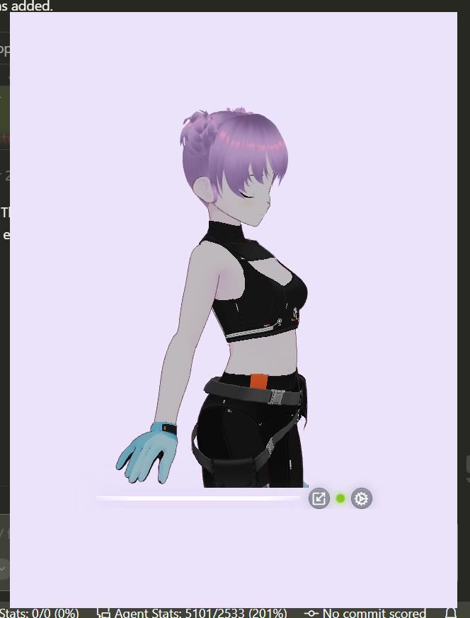
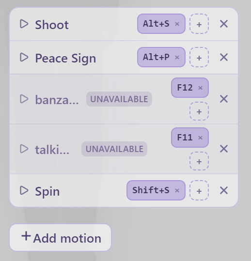

# Using AVATAR — complete user guide

This guide walks through every control in the **Electron desktop companion**. Prefer the [Windows installer](https://github.com/ARPAHLS/avatar/releases/download/v0.8.0/AVATAR-Setup-0.8.0.exe) when you can. From source: `npm run desktop`. Browser / localhost (`npm run dev`) is for contributors; some desktop-only features (overlay, device loopback, window scale, snap pad) are unavailable or limited there.

**Related:** [Installation](getting-started/installation.md) · [User settings / config.yaml](user-settings.md)

---

## 1. What you see on launch

1. A transparent **always-on-top** window appears (overlay mode).
2. The avatar loads (**Avatar 1** by default).
3. Motion starts on **Default**:
   - **Greeting** plays once
   - Then a loop forever: **Model Pose → Show Full Body → Peace Sign → Squat → Shoot**
4. On desktop, **audio** defaults to **Device output (auto)** so lip sync can follow system sound when capture is active.
5. Environment defaults to a soft **lavender color fade** (`#e9e1fa`).
6. Preferences from a previous session load from **`config.yaml`** if present (see [User settings](user-settings.md)).

Glass **bar** at the bottom: drag handle (line), **window scale**, optional green **live** dot, **gear** menu.

<p align="center">
  
</p>

<p align="center">
  
</p>

<p align="center">
  
  
</p>

---

## 2. Glass bar

### Move the window

- Drag the **horizontal glass line**.
- Or open **Settings** and use the **3×3 snap pad** to jump to a screen position.

### Window scale (desktop)

Tap the **Scaling** control (left of the live dot / gear). Choose:

| Preset | Effect |
| :--- | :--- |
| **×0.5** | Half size |
| **×1** | Default (~420×560 logical) |
| **×2** | Double size |

Scale is remembered in `config.yaml`.

<p align="center">
  
</p>

<p align="center">
  
</p>

<p align="center">
  
</p>

<p align="center">
  
</p>

### Live lip-sync dot

When an audio source is selected (not **Off**), an 8px dot sits left of the gear:

| Look | Meaning | Hover label |
| :--- | :--- | :--- |
| Soft **amber** | Waiting — source on, capture not ready yet | *Lip sync waiting for audio* |
| Soft **mint** | Capturing, quiet | *Lip sync listening* |
| Brighter **green** + stronger glow | Capturing, audio rising | *Lip sync active* |
| Soft **coral** | Capture error (open **Voice**) | *Lip sync error — open Voice* |

Loudness drives the green intensity while capturing; silence eases back to mint. With **reduced motion**, colors stay and the pulse freezes.

### Gear menu

| Item | Opens / does |
| :--- | :--- |
| **Appearance** | Avatars (built-ins or custom folder + VRoid Hub), environments |
| **Voice** | Audio source / lip sync |
| **Camera & Lighting** | Camera, lights, avatar transform |
| **Animations** | Submenu of clips (no drawer) |
| **Pinned / Windowed** | Toggle overlay vs opaque window (desktop) |
| **Settings** | Overlay mode, Snap to screen, **Directories**, **Animation hotkeys**, **Agents**, **VRoid Hub**, **System** (reset / config path) |
| **Close** | Quit the companion window (desktop) |

<p align="center">
  
  
</p>

---

## 3. Appearance

Gear → **Appearance**.

### Avatars

Pick **Avatar 1 / 2 / 3** when Directories → Avatars is **Default**.  
On desktop you can point Settings → Directories → Avatars at a folder of `.vrm` files — Appearance then shows **those instead** of the bundled list. **VRoid Hub** stays under Avatars either way. Picker thumbnails are static images, so the drawer opens without rendering every model: bundled avatars ship with theirs, and a custom folder builds its own the first time you open it — cards fill in as each finishes, and are instant from then on. Details: [Avatars](avatars.md).

On **desktop**, when VRoid Hub is connected, a **VRoid Hub** block appears
under the built-in thumbnails so you can pick Hub characters here (setup
still lives under Settings). Picking a **hearted** (someone else’s) character
first shows its conditions of use, where **View on VRoid Hub** opens the
model’s own page in your browser so you can check the author’s terms at the
source. See [VRoid Hub connection](vroid-hub.md).

<p align="center">
  
  
</p>

<p align="center">
  
</p>

<p align="center">
  
  
</p>

<p align="center">
  
</p>

### Environments

| Option | What you get |
| :--- | :--- |
| **Stars** | Dark starfield GIF |
| **Code** | Code-rain GIF |
| **Bloom** | Bright pastel GIF (bar often switches to “light” chrome) |
| **None** | No stage backdrop — desktop shows through (overlay) |
| **Custom** | Desktop: Settings → Directories → Environments (`.gif` / `.png` / `.jpg` / `.jpeg`). Dev with Directories Default: also `src/assets/environments/custom/`. Opening Custom hides built-ins until closed; Color fade stays pinned under the list |
| **Color fade** | Soft glow from a color you pick → **Use color** |
| **Reset** | Back to lavender `#e9e1fa` |

<p align="center">
  
  
  
</p>

<p align="center">
  
</p>

Full detail: [Environments](environments.md).

### Bar & button colors (chrome)

The bar and circular controls adapt to what sits **behind** the bar:

| Backdrop | Bar | Buttons |
| :--- | :--- | :--- |
| **Dark** | Whitish | Darker grey glass + **white** icons |
| **Light** | Grey | Lighter grey glass + **dark** icons |

In overlay mode the app samples the desktop near the window **after you finish moving** (and on focus), then crossfades bar/button colors. Environment GIFs themselves never change. In browser / windowed mode chrome follows the chosen environment.

<p align="center">
  
  
</p>

---

## 4. Voice & lip sync

Gear → **Voice**.

**Go deeper:** [Audio sources](voice/audio-sources.md) (every input) · [Lip sync](voice/lip-sync.md) (how the mouth moves).

### Desktop defaults

| Source | When to use |
| :--- | :--- |
| **Device output (auto)** | *(Default)* Follow speakers / system audio via loopback |
| **Pick app window** | Lip sync to one app/window’s audio |
| **Microphone** | Your mic |
| **Audio file** | Play a local file into the analyser |
| **Off** | No lip sync |

### Browser (dev) sources

**Off** *(default)*, **Microphone**, **Tab or window audio**, **Audio file**.

### Tips

- Raise **Sensitivity** when the live dot reacts but the mouth barely moves; lower it when background noise triggers the mouth. Its `1.00` default preserves the original analyser response.
- **Mouth limit** caps the strongest VRM mouth expression from `0.10` to the full `1.00`. It does not change whether audio is detected.
- Double-click either slider to restore `1.00`. Both values persist in `config.yaml`.
- Status shows a short plain-language line (for example **Capturing (local)** or **Pick a window…**), not raw codes.
- A privacy note in the panel states that lip sync analyses levels **locally** — nothing is uploaded.
- Use **Restart audio capture** if OS permissions or devices change; on permission denial, desktop builds can open system privacy settings.
- Mouth shapes are **amplitude-based** (not phoneme ASR). See [Lip sync](voice/lip-sync.md) and [Audio sources](voice/audio-sources.md) (permissions + privacy).

<p align="center">
  
</p>

<p align="center">
  
  
</p>

<p align="center">
  
  
</p>

<p align="center">
  
</p>

---

## 5. Camera & Lighting

Gear → **Camera & Lighting**. Three sections:

### Camera

| Control | Default | Notes |
| :--- | :--- | :--- |
| **X** | `-0.01` | Horizontal framing |
| **Y** | `0.59` | Height (heads stay in frame) |
| **Z** | `1.69` | Distance |
| **Look Y** | `0.5` | Look-at height |
| **FOV** | `26.8` | Field of view |

- **Reset Camera** — restore all camera defaults.
- **Double-click** a slider — reset **that** control only.

### Lighting

| Control | Default |
| :--- | :--- |
| **Intensity** | `0.7` |
| **X / Y / Z** | `1, 2, 2` |
| **Color** | `#ffffff` |

- **Reset Light** — full lighting defaults.
- Double-click sliders for per-axis / intensity reset.

### Avatar transform

Position **X / Y / Z** (default `0, -1.03, -1.48`).  
**Reset Avatar** restores position and default facing.

See [Camera & lighting](camera-and-lighting.md).

<p align="center">
  
</p>

<p align="center">
  
  
  
</p>

<p align="center">
  
  
</p>

---

## 6. Animations

Gear → **Animations**.

### Default (recommended)

1. **Greeting** once  
2. Loop: **Model Pose → Show Full Body → Peace Sign → Squat → Shoot**

**Spin** is available as a one-off clip but is **not** in the Default loop.

### Individual clips

Pick any listed VRMA clip to play that motion only. Choosing **Default** again restarts the greeting + loop.

Catalog: [VRMA](animations/vrma.md).

<p align="center">
  
  
</p>

---

## 7. Settings

Gear → **Settings**. Section titles share one style: **Overlay mode**, **Snap to screen**, **Directories**, **Animation hotkeys**, **Agents**, **VRoid Hub**, **System**.

### Overlay mode (desktop)

- **On (Pinned):** Transparent, always on top — companion over your apps.
- **Off (Windowed):** Opaque lavender window, normal stacking.

Also toggle from the gear **Pinned / Windowed** item.

### Snap to screen

Tap a cell in the **3×3 pad** (divider separates this from Overlay mode):

```text
Top left     | Top center     | Top right
Center left  | Center         | Center right
Bottom left  | Bottom center  | Bottom right
```

The active cell stays **highlighted**. If you **drag** the glass bar by hand, the highlight clears (no cell selected).

<p align="center">
  
</p>

<p align="center">
  
  
  
</p>

### Directories (desktop)

Three rows — **Avatars**, **Animations**, **Environments**:

| Row | Behavior |
| :--- | :--- |
| **Avatars** | `Default` (bundled) or `Custom` folder of `.vrm` files — **replaces** the Appearance avatar strip |
| **Animations** | `Default` (bundled pack) or `Custom` folder of `.vrma` files — **replaces** the Gear → Animations list |
| **Environments** | `Default` or `Custom` folder of images — **adds** the Appearance Custom expander; built-ins stay |

Every row scans the folder you pick **top level only** — subfolders are ignored. File names become menu labels.

A folder with no matching files is **not** applied (error notice; previous source kept). Reset a row (or **System → Reset all settings**) returns that source to Default. Choices persist in `config.yaml` under `directories` (mode + path).

With **Animations → Custom** active, the bundled **Default** greeting sequence and the VRMA Motion Pack are hidden — the folder is the whole menu. Your saved clip is matched by file path, so it survives a rescan; if that file is gone, the first clip in the folder is selected instead. Back on **Default**, the selection returns to the bundled **Default** sequence. Making your own `.vrma`: [VRMA animations](animations/vrma.md).

### Animation hotkeys

A shortlist of clips you can fire without changing what Gear → **Animations** is set to. **Add animation** picks a clip from the current catalog; each row takes any number of keys (**+** on the row, then press the chord). Pressing a chord — or clicking the row's name — plays that clip **once**, then the Animations selection comes back.

<p align="center">
  
</p>

Rows are yours, not a view of the folder: switching **Directories → Animations** does not delete them. A row whose clip is not in the current folder reads *unavailable* and keeps its keys reserved until that folder comes back; **Clear unavailable** is the only sweep. Past five rows the deck gets a filter box for reaching one without scrolling. Details and the `config.yaml` shape: [User settings](user-settings.md#motion-deck-motiondeck).

### Agents (desktop)

Off by default. **Enable local bus** starts a small server on `127.0.0.1:47903` so scripts and
agent frameworks can play an animation, swap the avatar, set the environment or switch the
lip-sync source — the same commands the menus and hotkeys use. Nothing outside this machine can
reach it, and anything arriving from a web page is refused.

**Require token** (on) generates a token the first time you enable the bus and reuses it after
that; **Copy token** and **Regenerate** are beside it, and **Copy example curl** gives you a
working one-liner with your port and token already in it. Details, the full command list and
`GET /v1/state`: [Local agent bus](agents/local-bus.md).

### VRoid Hub (desktop)

Register your own VRoid Hub OAuth app, paste Client ID / secret,
then **Connect VRoid Hub account**. After connecting, pick characters under
**Appearance → Avatars**. Hub models are **not** stored on disk — they last
for the current session only.

Full steps (redirect URI, app form fields, hearted-model license gate,
troubleshooting): [VRoid Hub connection](vroid-hub.md).

<p align="center">
  
  
</p>

<p align="center">
  
</p>

### System

**Reset all settings** wipes saved preferences (including Directories paths) and restores factory defaults (avatar, animation, environment, camera, light, avatar transform, audio source, overlay, window scale, directories). It does **not** remove encrypted VRoid Hub credentials — use **Remove app credentials** / **Disconnect** in the VRoid Hub block for that.

### Per-control resets (not “all”)

| Where | Control |
| :--- | :--- |
| Appearance → Environments | **Reset** (color fade) |
| Camera & Lighting → Camera | **Reset Camera** / double-click slider |
| Camera & Lighting → Lighting | **Reset Light** / double-click slider |
| Camera & Lighting → Avatar | **Reset Avatar** / double-click slider |
| Voice | **Restart audio capture** (does not change which source is selected) |

Persistence details: [User settings](user-settings.md).

---

## 8. Everyday workflow (quick)

1. Place the companion with drag or the snap pad.  
2. Set scale ×0.5 / ×1 / ×2.  
3. Appearance → pick avatar and environment. Optional: Settings → Directories for local folders, and/or Settings → connect VRoid Hub then Appearance → pick a Hub character.  
4. Voice → Device output (or window/mic) until the live dot turns mint/green when sound plays.  
5. Leave **Default** animation running, or pick a single clip.  
6. Nudge Camera if framing feels off; use section resets or **Reset all** if you want a clean slate.

---

## 9. Keyboard / mouse notes

- Settings → **Animation hotkeys** binds keys to clips; they fire while the AVATAR window has focus (see [User settings](user-settings.md#motion-deck-motiondeck)). Nothing is bound out of the box, and there is still no OS-wide hotkey — every other action is pointer-driven.  
- Click outside a drawer/menu (or blur the window on desktop) to dismiss menus.  
- The 3D canvas does not steal drag — move via the glass bar.
