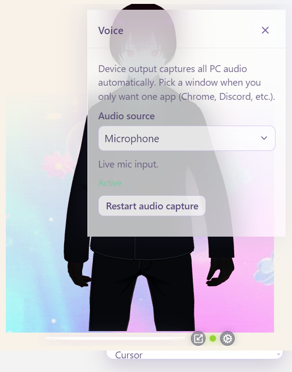
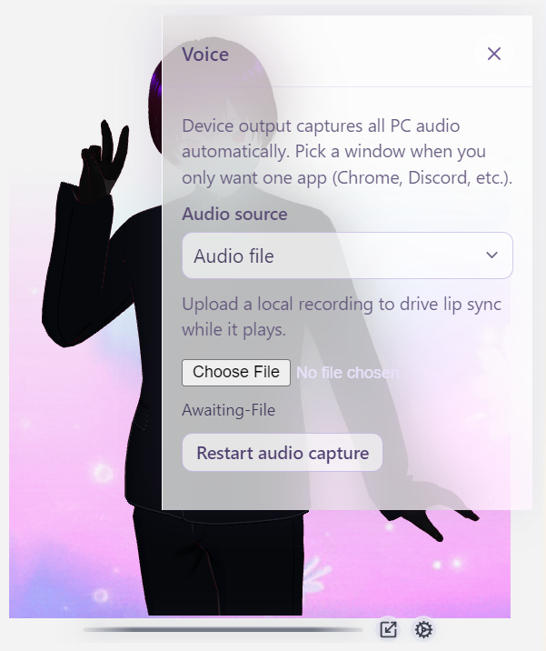
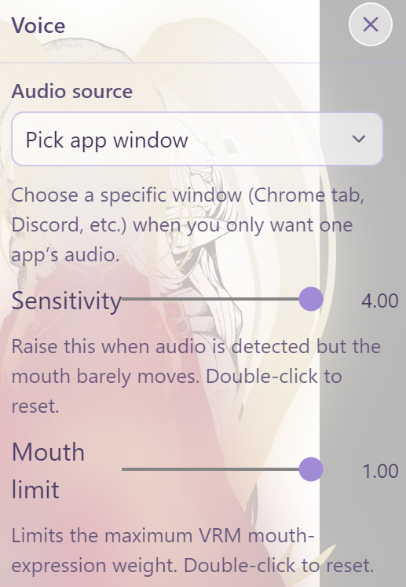

# Audio sources

Gear → **Voice** → **Audio source**.

This is the full reference for every lip-sync input. Mouth shapes themselves are covered in [Lip sync](lip-sync.md). Everyday walkthrough: [Using the app → Voice](../using-the-app.md#4-voice--lip-sync).

  

---

## Desktop (Electron) — recommended

| Option | id | Description |
| :--- | :--- | :--- |
| **Device output (auto)** | `system` | **Default.** Captures what your speakers play (loopback). Best for music, videos, local LLMs talking through the OS mixer. |
| **Pick app window** | `window` | Choose a specific window/screen from the **Window or screen** list, then wait until status reads **Capturing (local)**. |
| **Microphone** | `microphone` | Your default input device. |
| **Audio file** | `file` | Pick a local audio file; it plays into the analyser. |
| **Off** | `none` | Lip sync disabled; green live dot hidden. |

  
  
  

### Permissions / troubleshooting

- **Sensitivity** scales the measured level for every non-Off source. Raise it when the live dot reacts but the mouth barely moves; lower it when background noise moves the mouth. Double-click the slider to reset to `1.00`.
- **Mouth limit** caps the maximum VRM mouth-expression weight (`0.10`–`1.00`) without changing audio detection.
- First capture may prompt for **microphone** or **screen/audio** permission depending on the OS and source. That is expected for Device output, Pick app window, Microphone, and browser Tab capture.
- Status in Gear → **Voice** is written in plain language (`Starting capture…`, `Capturing (local)`, `Pick a window…`, …). Older builds showed raw tokens such as `starting` / `error`.
- If capture is denied, the panel explains that **permission was refused**, suggests **Restart audio capture**, and on desktop can open **system privacy settings** (Windows: Settings → Privacy & security → Microphone; also check Screen and voice recording if your OS lists it).
- If status sticks on an error after you allow access, click **Restart audio capture**, or switch source Off and back.
- `Pick a window…` / `Pick an audio file…` means finish choosing a target — not a failure.

  

### Privacy (what stays local)

AVATAR uses capture only to **measure audio levels on this device** for lip sync (amplitude → mouth shapes). Streams are not recorded to disk as part of Voice, and **nothing is uploaded** to ARPA or any third-party avatar service. Device output / window capture may use the OS screen-audio APIs; that still stays in the local process. See also the short privacy line in the [README](../../README.md#privacy).

---

## Browser (dev / contributors)

| Option | id | Notes |
| :--- | :--- | :--- |
| **Off** | `none` | **Default** in the browser |
| **Microphone** | `microphone` | Requires getUserMedia permission |
| **Tab or window audio** | `tab` | Browser display-media / tab capture |
| **Audio file** | `file` | Same as desktop |

System-wide **device output** loopback is an Electron feature — use the [Windows installer](https://github.com/ARPAHLS/avatar/releases/download/v0.8.0/AVATAR-Setup-0.8.0.exe) or `npm run desktop` / `npm run dev:desktop`.

---

## Live indicator

When the source is not **Off**, a status-aware **live dot** sits on the glass bar (waiting amber → mint/green while capturing → coral on error). Green intensity tracks loudness; see [Lip sync → Live UI](lip-sync.md#live-ui).

  
  

---

## Persistence

`audioSourceId`, `lipSyncSensitivity`, `lipSyncMouthStrength` (and `windowSourceId` when relevant) are stored in `config.yaml`.
Uploaded files are **not** restored after quit — pick the file again.  
[User settings](../user-settings.md).
