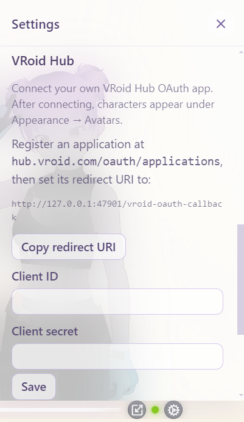
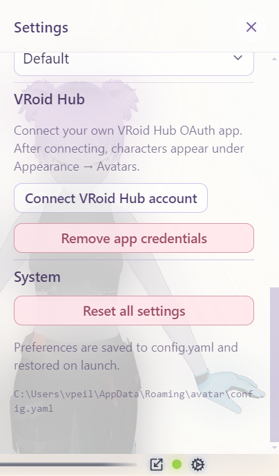
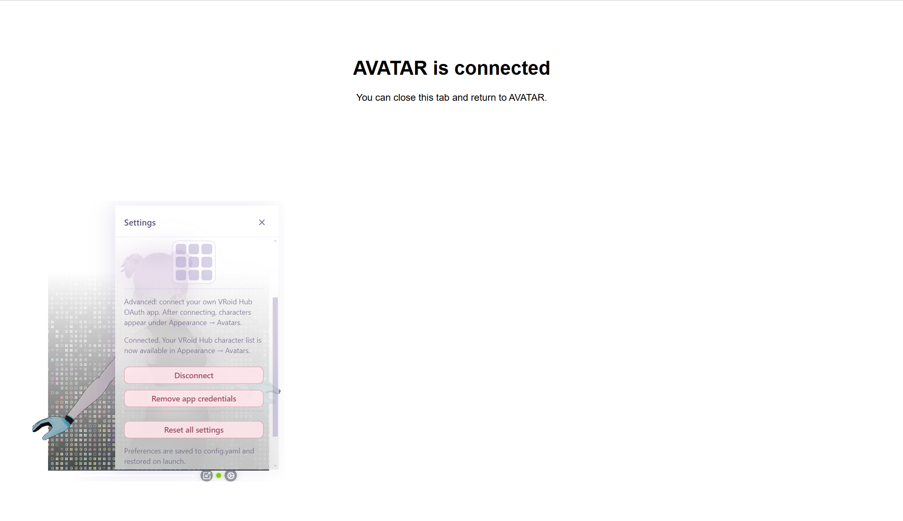
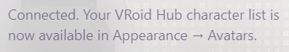
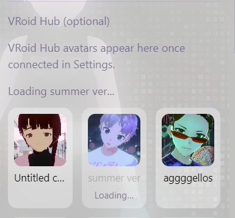
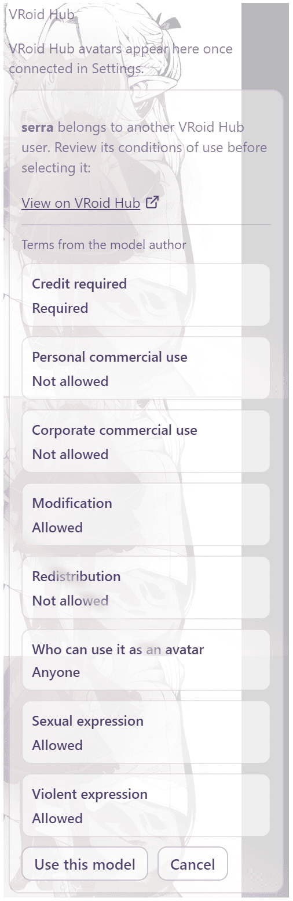

# VRoid Hub connection

AVATAR can sign in to [VRoid Hub](https://hub.vroid.com) and use a character
you own — or one you have hearted that its author marked available to other
users — without saving a free-standing `.vrm` file on disk.

This is **opt-in, off by default, and advanced**: you register your **own**
OAuth application at VRoid Hub (AVATAR does not ship a shared client secret).
It is an **Electron-only** feature (`npm run desktop`, `npm run dev:desktop`,
or the Windows installer). It does nothing in the browser / `npm run dev`
preview.

**Where in the app**

| Step | Where |
| :--- | :--- |
| Register OAuth app + connect account | Gear → **Settings** → VRoid Hub |
| Browse and select Hub characters | Gear → **Appearance** → **Avatars** (below the built-ins) |

---

## What you need

- AVATAR **desktop** (installer or Electron from source)
- A [VRoid Hub](https://hub.vroid.com) account
- Permission to create an OAuth application at
  [`hub.vroid.com/oauth/applications`](https://hub.vroid.com/oauth/applications)
- Characters you **own**, and/or **hearted** models marked available to other
  users

---

## Step 1 — Register a VRoid Hub OAuth application

1. Open
   [`hub.vroid.com/oauth/applications`](https://hub.vroid.com/oauth/applications)
   while signed in to VRoid Hub.
2. Create a new application. Suggested fields:

   | Field | Suggested value |
   | :--- | :--- |
   | Application name | `AVATAR` (or your preferred label) |
   | Service URL | Your project / product URL (e.g. the GitHub repo or site you use for AVATAR) |
   | Summary / overview | Short line: desktop companion that displays your VRoid Hub characters as a live overlay |
   | Redirect URI | Exact value from AVATAR Settings (see Step 2) — typically `http://127.0.0.1:47901/vroid-oauth-callback` |
   | Usage as avatar | **Yes** (required so AVATAR can license models for display) |

3. After creation, copy the **Client ID** and **Client secret**.

> The redirect URI is a **local loopback** URL served by AVATAR itself during
> sign-in. It is **not** a public website. Dev builds and the installed `.exe`
> use the same pattern.

  

---

## Step 2 — Paste credentials in AVATAR Settings

1. Launch AVATAR desktop.
2. Gear → **Settings**.
3. In the VRoid Hub block:
   - Copy the **redirect URI** shown in the panel (use **Copy redirect URI**)
     and paste it into your VRoid OAuth app if you have not already.
   - Paste **Client ID** and **Client secret**.
   - Click **Save**.

Credentials are encrypted at rest with Electron `safeStorage` (OS keychain /
Credential Manager) in `vroid-hub-credentials.json` under the app’s
`userData` folder. Session tokens go in `vroid-hub-auth.json` the same way.

If secure storage is unavailable (for example Linux without a keyring), AVATAR
disables saving credentials rather than writing them in plaintext.

After Save, **Connect VRoid Hub account** becomes available:

  

---

## Step 3 — Connect your VRoid Hub account

1. Still in **Settings**, click **Connect VRoid Hub account**.
2. Your system browser opens VRoid Hub’s authorization page (OAuth2 + PKCE).
3. Approve the app.
4. The browser redirects to the local loopback URL; you should see a short
   success page (**AVATAR is connected**). You can close that tab and return
   to AVATAR.
5. Settings then shows that you are **connected**, and points you to
   **Appearance → Avatars** for the character list.

**Disconnect** ends the signed-in session (and clears any Hub character held
in memory) but keeps your saved OAuth app credentials.

**Remove app credentials** deletes the saved client ID/secret and implies a
disconnect — you must paste them again to reconnect.

  

  

---

## Step 4 — Pick a character in Appearance

1. Gear → **Appearance** → **Avatars**.
2. Built-in avatars (Avatar 1 / 2 / 3) appear as before.
3. Below them, **VRoid Hub** lists your Hub characters (name +
   portrait) when connected.
4. Click a character you **own** — AVATAR downloads and loads it on the stage.
5. Click a **hearted** (someone else’s) character — review its conditions of
   use, with **View on VRoid Hub** linking to the model’s source page in your
   browser, then **Use this model**.

While a download is in progress, the card shows **Loading…**. You can switch
drawers; when the load finishes (or fails), status returns under Appearance /
the Hub block.

Use the **refresh** icon to reload the Hub list. **Disconnect** is also
available here.

  

  
  

  

  

If you are not connected yet, Appearance shows a short path to open Settings
and finish setup.

---

## What is stored where

| Data | Location | Survives restart? |
| :--- | :--- | :--- |
| OAuth client ID / secret | Encrypted `vroid-hub-credentials.json` in Electron `userData` | Yes |
| Access / refresh tokens | Encrypted `vroid-hub-auth.json` in Electron `userData` | Yes (until disconnect / expiry) |
| Hub character VRM bytes | **Memory only** (`blob:` URL for the session) | **No** |
| Built-in avatar choice | `config.yaml` | Yes |

AVATAR does **not** write a Hub-sourced model to disk as a reusable local
`.vrm`. That matches VRoid Hub’s linked-app rules. After quit, pick the Hub
character again (or use a built-in). Switching built-in ↔ already-loaded Hub
character in the **same** session is instant — nothing is re-downloaded.

On Windows, `userData` is typically under
`%AppData%\Roaming\avatar\` (path also shown at the bottom of Settings).

---

## Network notes

Sign-in and character **listing** talk to `hub.vroid.com`. Selecting a model
also downloads VRM bytes from a **presigned storage / CDN URL** after a
license step. If listing works but loading times out or resets, try another
network path (for example a mobile hotspot) — the CDN route can differ from
the Hub website even when Chrome can browse Hub normally.

---

## Troubleshooting

| Symptom | What to check |
| :--- | :--- |
| No VRoid UI / “desktop only” | Use Electron / installer, not `npm run dev` alone |
| Connect stays unavailable | Save Client ID + secret first; confirm secure storage works on this OS |
| Browser connect fails | Redirect URI must **exactly** match Settings (including port and path) |
| List empty | Own models on Hub, or heart models marked available to other users |
| Hearted model blocked | Review conditions of use; confirm the Hub app allows **Usage as avatar** |
| License OK, download fails / times out | Network path to the file host (see Network notes) |
| Character gone after relaunch | Expected — Hub models are session-only; reselect in Appearance |

---

## Why it works this way

- **Loopback redirect, not a custom `avatar://` scheme** — reliable across
  `npm run desktop` and the packaged `.exe`.
- **Your own OAuth app** — avoids a shared secret across every install.
- **Session-only Hub characters** — linked-app usage without unconditional
  local caching of Hub VRMs.
- **Settings vs Appearance** — Settings is for link/account; Appearance is
  where you choose what is on stage (built-ins + Hub).

See also: [Avatars](avatars.md) · [Using the app](using-the-app.md) ·
[User settings](user-settings.md).
